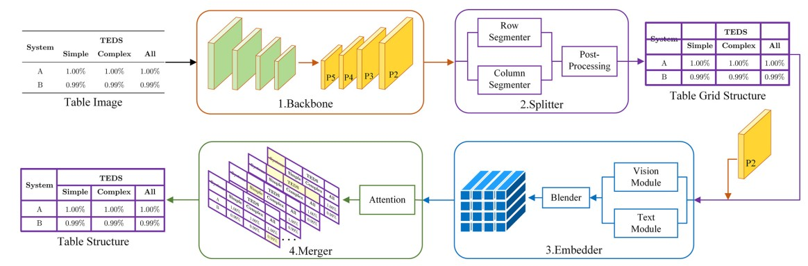

# Split, Embed and Merge: An accurate table structure recognizer  

This repository contains the source code of our Pattern Recognition 2022 paper: [Split, Embed and Merge: An accurate table structure recognizer](https://arxiv.org/abs/2107.05214).

## Introduction



Split, Embed and Merge (SEM) is a new framework for parsing the tabular data into the structured format, which is mainly composed of three parts, splitter, embedder and merger. We won the first place of complex tables and third place of all tables in Task-B of ICDAR 2021 Competition on Scientific Literature Parsing.


## Dataset

We provide scripts for processing the **SciTSR** dataset, which contains 15,000 tables in PDF format as well as their corresponding structure labels.  

It’s worth noting  that we need to align the text information with the table cells in order to generate labels of splitter.

## Requirements

- torch==1.7.1

## Training and Testing

```shell
python runner/train.py --cfg default
```

## Citation

If you find SEM useful in your research, please consider citing:

```
@article{zhang2022split,
  title={Split, embed and merge: An accurate table structure recognizer},
  author={Zhang, Zhenrong and Zhang, Jianshu and Du, Jun and Wang, Fengren},
  journal={Pattern Recognition},
  volume={126},
  pages={108565},
  year={2022},
  publisher={Elsevier}
}
```